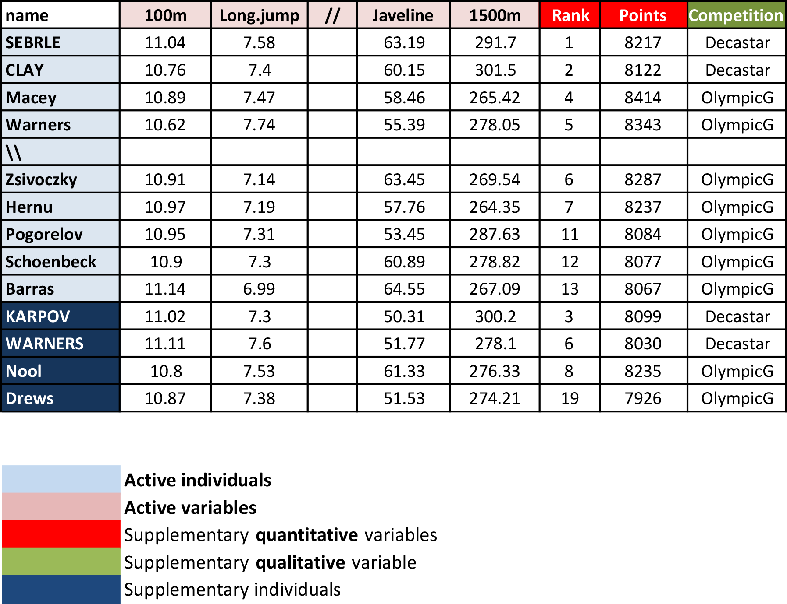

```{r setup, include=FALSE, message=FALSE}
knitr::opts_chunk$set(echo = FALSE)
knitr::opts_chunk$set(comment = NA)
library(tidyverse)
library(DT)
library(FactoMineR)
library(factoextra)
library(corrplot)
library(viridis)
data(decathlon)
html_table <- function(x, offset = 5) {
  DT::datatable(
    data = x, 
    rownames = TRUE, 
    options = list(
      scrollX = TRUE, 
      searching = FALSE, 
      lengthMenu = c(0, 5, 10, 15) + offset
    )
  )
}
```

# Overview

## Dimensionality reduction

If you've worked with a lot of variables before, you know this can present problems. Do you understand the relationships between each variable? Do you have so many variables that you are in danger of overfitting your model to your data or that you might be violating assumptions of whichever modeling tactic you're using?

You might ask the question, "How do I take all of the variables I've collected and focus on only a few of them?" In technical terms, you want to "reduce the dimension of your feature space." By reducing the dimension of your feature space, you have fewer relationships between variables to consider and you are less likely to overfit your model.

Think about linear regression:

- multicollinearity issues;
- difficult to use strategies like backward elimination.

## PCA

**What ?**

Principal component analysis is a technique for feature extraction --- so it combines our input variables in a specific way, then we can drop the "least important" variables while still retaining the most valuable parts of all of the variables! As an added benefit, each of the "new" variables after PCA are all independent of one another.

**How ?**

The dimension reduction is achieved by identifying the principal directions, called **principal components**, in which the data varies.

PCA assumes that the directions with the largest variances are the most “important” (i.e, the most principal).

**When to use?**

1. Do you want to reduce the number of variables, but aren't able to identify variables to completely remove from consideration?
2. Do you want to ensure your variables are independent of one another?
3. Are you comfortable making your independent variables less interpretable?

## Principle

<!--  -->


- The 1st principal component (PC) accounts for the largest possible variance in the data set;
- i.e. the line in which the projection of the points (red dots) is the most spread out.
- The second PC is uncorrelated to the 1st PC and maximizes the remaining variance;
- etc.

## Mathematical formalism

<div style="float: left; width: 50%;">
**Context.**

$\mathbf{X}_1, \dots, \mathbf{X}_n$ a sample of $n$ *i.i.d.* random vectors in $\mathbb{R}^p$. Let $\mathbb{X} = (\mathbf{X}_1, \dots, \mathbf{X}_n)^\top$ be the $n \times p$ data matrix, whose $j$-*th* column is the vector $\mathbf{x}_j$ containing the $n$ observations on the $j$-*th* variable. Let $\Sigma$ be the covariance structure of the $\mathbf{X}_i$'s.

**Determination of the 1st PC**

The 1st principal component (PC) accounts for the largest possible variance in the data set.

> - Search a linear projection $\mathbf{a} \in \mathbb{R}^p$ of the original variables (columns of $\mathbb{X}$) with maximal variance. Such projection reads $\mathbb{X} \mathbf{a}$ of which each component has variance: $$ \mathrm{Var}( \left[ \mathbb{X} \mathbf{a} \right]_i) = \mathbf{a}^\top \Sigma \mathbf{a}. $$
</div>

<div style="float: left; width: 50%;">
> - Requires additional constraint because maximum does not exist in $\mathbb{R}^p$: search for $\| \mathbf{a} \| = 1$. 
> - The sample covariance $S$ is an unbiased estimator of $\Sigma$, hence we can instead solve: $$ \max_{\mathbf{a} \in \mathcal{S}^{p-1}} \mathbf{a}^\top S \mathbf{a} = \max_{\mathbf{a} \in \mathbb{R}^p} \frac{\mathbf{a}^\top S \mathbf{a}}{\mathbf{a}^\top \mathbf{a}} $$
> - Solution is eigenvector of $S$ associated to the largest eigenvalue:
>     - constrained problem is equivalent to maximizing $\mathbf{a}^\top S \mathbf{a} - \lambda (\mathbf{a}^\top \mathbf{a} - 1)$;
>     - differentiation leads to $S \mathbf{a} = \lambda \mathbf{a}$; hence, $\mathbf{a}$ is an eigenvector of $S$;
>     - hence we get $\mathbf{a}^\top S \mathbf{a} = \lambda$  which means that $\lambda$ must be the largest eigenvalue of $S$ in order to maximize $\mathbf{a}^\top S \mathbf{a}$.
</div>

## R Packages {.build}

### Principal Component Computation

- `prcomp()` and `princomp()` from built-in R **stats** package,
- `PCA()` from [**FactoMineR**](https://factominer.free.fr) package,
- `dudi.pca()` from [**ade4**](https://pbil.univ-lyon1.fr/ade4/home.php?lang=eng) package.

### Recommendation

The `FactoMineR::PCA()` function.

### Information Extraction and Visualization

The **factoextra** package.

## Case Study

- Athletes’ performance during two sporting events (Decastar and OlympicG)
- It contains $41$ individuals (athletes) described by $13$ variables.

```{r decathlon-data}
html_table(decathlon)
```

## Objectives {.build}

PCA allows to describe a data set, to summarize a data set, to reduce the dimensionality. 
We want to perform a PCA on all the individuals of the data set to answer several questions:

#### Individuals' study (athletes' study)

Two athletes will be close to each other if their results to the events are close. We want to see the variability between the individuals. 

  - Are there similarities between individuals for all the variables? 
  - Can we establish different profiles of individuals?
  - Can we oppose a group of individuals to another one?

#### Variables' study (performances' study)

We want to see if there are linear relationships between variables. The two objectives are to summarize the correlation matrix and to look for synthetic variables: can we resume the performance of an athlete by a small number of variables?

#### Link between this two studies

Can we characterize groups of individuals by variables?

## PCA Terminology

<div style="float: left; width: 55%;">
```{r pca-terminology, out.width="90%"}

```
</div>

<div style="float: right; width: 45%;">
*Active individuals*: Individuals used for PCA.

*Supplementary individuals*: Coordinates of these individuals will be predicted using the PCA information and parameters obtained using active individuals.

*Active variables*: Variables used for PCA.

*Supplementary variables*: Coordinates of these variables will be predicted also. These can be:

- *Supplementary continuous variables*: Cols 11 and 12 correspond respectively to the rank and the points of athletes.
- *Supplementary qualitative variables*: Col 13 corresponds to the two athletic meetings (2004 Olympic Game or 2004 Decastar). This is a categorical variable. It can be used to color individuals by groups.
</div>

## Data standardization {.build}

### Description of the problem

- PCA linearly combines original variables to maximize variance

- If one variable is measured in meter and another in centimeter, the first one will contribute more to the variance than the second one, even if the *intrinsic* variability of each variable is the same.

<div style="color: red; text-align: center;">
<font style="font-size: larger;">
$\Longrightarrow$ We need to scale the variables prior to performing PCA!
</font>
</div>

### A common solution: Standardization

$$ x_{ij} \leftarrow \frac{x_{ij} - \overline{x}_j}{\sqrt{\frac{1}{n-1} \sum_{\ell=1}^n (x_{\ell j} - \overline{x}_j)^2}} $$

<div style="color: green; text-align: center;">
<font style="font-size: larger;">
$\Longrightarrow$ The function `PCA()` in [**FactoMineR**](http://factominer.free.fr), standardizes the data automatically.
</font>
</div>

## `PCA()` Syntax

```{r pca-syntax, eval=FALSE, echo=TRUE}
PCA(
  # a data frame with n rows (individuals) and p columns (numeric variables)
  X = , 
  
  # number of dimensions kept in the results (by default 5)
  ncp = , 
  
  # a vector indicating the indexes of the supplementary individuals
  ind.sup = , 
  
  # a vector indicating the indexes of the quantitative supplementary variables
  quanti.sup = ,
  
  # a vector indicating the indexes of the categorical supplementary variables
  quali.sup = , 
  
  # boolean, if TRUE (default) a graph is displayed
  graph = 
)
```

## Running `PCA()`

```{r pca-cmd, echo=TRUE, eval=FALSE}
PCA(X = decathlon[, 1:10], graph = FALSE)
```

```{r pca-run}
res_pca <- PCA(
  X = decathlon[, 1:10], 
  graph = FALSE
)
print(res_pca)
```

## Visualization and Interpretation {.build}

### The **factoextra** package

- It helps with interpretation of PCA.
- No matter what function you decide to use (`stats::prcomp()`, `FactoMiner::PCA()`, `ade4::dudi.pca()`, `ExPosition::epPCA()`), you can easily extract and visualize the results of PCA using R functions provided in the **factoextra** R package.

### Useful extraction and visualization functions

- `get_eigenvalue()`: Extract the eigenvalues/variances of principal components.
- `fviz_screeplot()`: Visualize the eigenvalues / proportion of explained variance.
- `get_pca_ind()`, `get_pca_var()`: Extract the results for individuals and variables, respectively.
- `fviz_pca_ind()`, `fviz_pca_var()`: Visualize the results individuals and variables, respectively.
- `fviz_pca_biplot()`: Make a biplot of individuals and variables.

# Choice of the reduced dimension

## Eigenvalues / Variances

<div style="color: green;">
<font style="font-size: larger;">
Eigenvalues measure the amount of variation retained by each principal component.
</font>
</div>

```{r eig, echo=TRUE}
eig_val <- get_eigenvalue(res_pca)
html_table(eig_val)
```

## Choosing the appropriate number of PCs {.build}

Eigenvalues can be used to determine the number of principal components to retain after PCA.

<div style="float: left; width: 45%;">
**Guidelines.**

- An eigenvalue > 1 indicates that PCs account for more variance than accounted by one of the original variables in standardized data. This is commonly used as a cutoff point for which PCs are retained. This holds true only when the data are standardized.
- Balance between a small number to achieve dimensionality reduction well and proporition of total variance explained.
- Look at the first few principal components to find interesting patterns in the data.
</div>

<div style="float:right; width: 55%;">
**Graphical tool.**

```{r screeplot-plot, out.width="90%"}
fviz_screeplot(res_pca, addlabels = TRUE)
```

```{r screeplot-code, echo=TRUE, eval=FALSE}
fviz_screeplot(res_pca, addlabels = TRUE)
```
</div>

# Analysis of the variables

## Variable Information in PCA {.build}

### Variable information extraction

```{r pca-var, echo=TRUE}
var_info <- get_pca_var(res_pca)
```

### Components

- `var_info$coord`: Coordinates for the variables.
- `var_info$cos2`: Quality of representation of variables by PC: `var.cos2 = var.coord * var.coord`.
- `var_info$contrib`: Contributions of the variables to the principal components: `(var.cos2 * 100) / (sum cos2 of the component)`.

### Usage

- Investigate the ability of PCs to strongly represent variables.
- Describe each PC in terms of the most contributing variables.

## `$coord`: Correlation variables & components

```{r pca-var-coord}
html_table(var_info$coord, offset = 10)
```

<div style="color: green; text-align: center;">
Property: norms of column vectors is 1 (eigenvectors).  
Consequence: each coordinate is in [-1,1].
</div>

# Contribution of PCs to variables

## `fviz_pca_var()`: Correlation circle

```{r pca-corrcirc, echo=TRUE, fig.align='center'}
fviz_pca_var(res_pca, col.var = "black")
```

## `$cos2`: Quality of representation

```{r pca-var-cos2}
html_table(var_info$cos2, offset = 10)
```

<div style="color: green; text-align: center;">
**Positive** and **negative** strong correlations of PCs to a given variable imply that the PCs represent it well.  
**Squared** correlations thus measure quality of representation.
</div>

## `$cos2`: Graphical tool 1

```{r pca-var-cos2-plot1, fig.align='center', echo=TRUE}
corrplot::corrplot(var_info$cos2, is.corr = FALSE)
```

## `$cos2`: Graphical tool 2

```{r pca-var-cos2-plot2, fig.align='center', echo=TRUE}
# Total cos2 of variables on Dim.1 and Dim.2
factoextra::fviz_cos2(res_pca, choice = "var", axes = 1:2)
```

## `$cos2`: Summary {.build}

<div style="float: left; width: 40%;">
- The `cos2` values are used to estimate the quality of the representation.
- High `cos2` indicates a good representation of the variable by the corresponding PC.
- Low `cos2` indicates that the variable is poorly represented by the corresponding PC.
- Variables close to circle in plot are **very well** represented by the 1st two PCs.
- Variables close to center in plot are **not well** represented by the 1st two PCs.
</div>

<div style="float: right; width: 60%;">
```{r pca-var-plot-res, fig.align='center', out.width="100%"}
factoextra::fviz_pca_var(
  X = res_pca, 
  col.var = "cos2",
  gradient.cols = viridis::viridis(3),
  repel = TRUE
)
```
</div>

<div style="float: left; width: 100%;">
```{r pca-var-plot-code, eval=FALSE, echo=TRUE}
factoextra::fviz_pca_var(X = res_pca, 
                         col.var = "cos2",
                         gradient.cols = viridis::viridis(3),
                         repel = TRUE) # Avoid text overlapping
```
</div>

# Contribution of variables to PCs

## `$contrib`: Important variables

```{r pca-var-contrib}
html_table(var_info$contrib, offset = 9)
```

<div style="color: green;">
- Variables correlating with `Dim.1` (PC1) and `Dim.2` (PC2) are the most important to explain the variability in the data set.
- Variables that do not correlate with any PC or only with the last ones are variables might be removed to simplify the overall analysis.
</div>

## `$contrib`: Graphical tool 1

```{r pca-var-contrib-plot1, fig.align='center', echo=TRUE}
corrplot::corrplot(var_info$contrib, is.corr = FALSE)
```

## `$contrib`: Graphical tool 2

<div style="float: left; width: 50%;">
```{r pca-var-contrib-plot2-pc1, fig.align='center', echo=TRUE, out.width="99%"}
# Contributions of variables to PC1
factoextra::fviz_contrib(
  X = res_pca, 
  choice = "var", 
  axes = 1, 
  top = 10
)
```
</div>

<div style="float: right; width: 50%;">
```{r pca-var-contrib-plot2-pc2, fig.align='center', echo=TRUE, out.width="99%"}
# Contributions of variables to PC2
factoextra::fviz_contrib(
  X = res_pca, 
  choice = "var", 
  axes = 2, 
  top = 10
)
```
</div>

## `$contrib`: Summary

```{r pca-var-contrib-plot, fig.align='center', fig.height=4, echo=TRUE}
factoextra::fviz_pca_var(
  X = res_pca, 
  col.var = "contrib",
  gradient.cols = viridis::viridis(3),
  repel = TRUE
)
```

## Component description

```{r pca-var-dimdesc, echo=TRUE}
res_pca_var_desc <- FactoMineR::dimdesc(res = res_pca, axes = c(1, 2), proba = 0.05)
```

<div style="float: left; width: 50%; text-align: center;">
**Description of PC1**
```{r pca-var-desc-pc1, fig.align='center', out.width="95%"}
html_table(res_pca_var_desc$Dim.1$quanti, offset = 10)
```
</div>

<div style="float: right; width: 50%; text-align: center;">
**Description of PC2**
```{r pca-var-desc-pc2, fig.align='center', out.width="95%"}
html_table(res_pca_var_desc$Dim.2$quanti, offset = 10)
```
</div>

# Analysis of the individuals

## The reduced space

### Individual information extraction

```{r pca-ind, echo=TRUE}
ind_info <- get_pca_ind(res_pca)
```

### Components

- `ind_info$coord`: Coordinates of the individuals.
- `ind_info$cos2`: Quality of representation of individuals by PC: `ind.cos2 = ind.coord * ind.coord`.
- `ind_info$contrib`: Contributions of the individuals to the principal components: `(ind.cos2 * 100) / (sum cos2 of the component)`.

### Usage

- The reduced space should allow easier identification of patterns, provided that it represents them well.
- Individuals that are similar are grouped together on the plot.

## First factorial plane & quality

```{r res-pca-ind-cos2, echo=TRUE, fig.align='center', fig.height=4, warning=FALSE}
factoextra::fviz_pca_ind(
  X = res_pca, 
  col.ind = "cos2", 
  gradient.cols = viridis::viridis(3),
  repel = TRUE # Avoid text overlapping (slow if many points)
)
```

## First factorial plane & contribution

```{r res-pca-ind-contrib, echo=TRUE, fig.align='center'}
# Total contribution on PC1 and PC2
factoextra::fviz_contrib(res_pca, choice = "ind", axes = 1:2)
```

## First factorial plane colored by groups

```{r res-pca-competition-code, eval=FALSE, echo=TRUE}
factoextra::fviz_pca_ind(
  X = res_pca,
  col.ind = decathlon$competition[1:23], # color by groups
  palette = viridis::viridis(3),
  addEllipses = TRUE, # Concentration ellipses
  legend.title = "Competition"
)
```

<div style="float: left; width: 42%;">
- This plot is useful to understand the ability of a factorial plane to discriminate individuals based on some feature.
- Here, we see a tendency with positive score on PC1 for athletes at the Olympics and negative PC1 scores for athletes at the Decastar.
- But, ellipses seem to overlap significantly.
</div>

<div style="float: right; width: 58%;">
```{r res-pca-competition-plot, fig.align='center', echo=FALSE, out.width="95%"}
factoextra::fviz_pca_ind(
  X = res_pca, 
  col.ind = decathlon$Competition, # color by groups
  palette = viridis::viridis(3),
  addEllipses = TRUE, # Concentration ellipses
  legend.title = "Competition"
)
```
</div>

# Combined variable and individual analysis

## Biplot

```{r res-pca-biplot-code, echo=TRUE, eval=FALSE}
factoextra::fviz_pca_biplot(
  X = res.pca, 
  repel = TRUE,
  col.var = "#2E9FDF", # Variables color
  col.ind = "#696969"  # Individuals color
)
```

<div style="float: left; width: 42%;">
- Only useful when there is a low number of variables and individuals in the data set; otherwise unreadable.
- Coordinate of individuals and variables are not constructed on the same space: focus on the direction of variables but not on their absolute positions.
- An individual that is on the same side of a given variable has a high value for this variable.
- An individual that is on the opposite side of a given variable has a low value for this variable.
</div>

<div style="float: right; width: 58%;">
```{r res-pca-biplot-plot, fig.align='center', echo=FALSE, out.width="95%"}
factoextra::fviz_pca_biplot(
  X = res_pca, 
  repel = TRUE,
  col.var = "#2E9FDF", # Variables color
  col.ind = "#696969"  # Individuals color
)
```
</div>

## Interpretation

- The first two dimensions resume 50% of the total inertia (i.e. the total variance of data set).
- The variable `100m` is correlated negatively to the variable `long.jump`. When an athlete performs a short time when running 100m, he can jump a big distance. Here one has to be careful because a low value for the variables `100m`, `400m`, `110m.hurdle` and `1500m` means a high score: the shorter an athlete runs, the more points he scores.
- The first axis opposes athletes who are **good everywhere** like Karpov during the Olympic Games to those who are **bad everywhere** like Bourguignon during the Decastar. This dimension is particularly linked to the variables of speed and long jump which constitute a homogeneous group.
- The second axis opposes athletes who are **strong** (variables `Discus` and `Shot.put`) to those who are **weak**. 
- The variables `Discus`, `Shot.put` and `High.jump` are not much correlated to the variables `100m`, `400m`, `110m.hurdle` and `Long.jump`. This means that strength is not much correlated to speed.

<div style="color: green; text-align: center;">
<font style="font-size: larger;">
At this point, we can divide the first factorial plane into four parts: fast and strong athletes (like Sebrle), slow athletes (like Casarsa), fast but weak athletes (like Warners) and slow and weak athletes (like Lorenzo).
</font>
</div>

## Your turn

- Download the lab file and related data sets from the course website in a folder on your computer.
- Open the file `12-PCA-Exercises.qmd` and perform the PCA analyses for the proposed data sets.

## References

- <https://towardsdatascience.com/a-one-stop-shop-for-principal-component-analysis-5582fb7e0a9c>
- <http://www.sthda.com/english/articles/31-principal-component-methods-in-r-practical-guide/112-pca-principal-component-analysis-essentials/>
- <https://builtin.com/data-science/step-step-explanation-principal-component-analysis>
- <https://royalsocietypublishing.org/doi/pdf/10.1098/rsta.2015.0202>
- <http://www.sthda.com/english/articles/31-principal-component-methods-in-r-practical-guide/112-pca-principal-component-analysis-essentials/>
- <http://factominer.free.fr/factomethods/principal-components-analysis.html>
